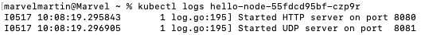
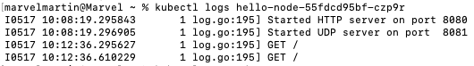
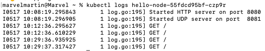
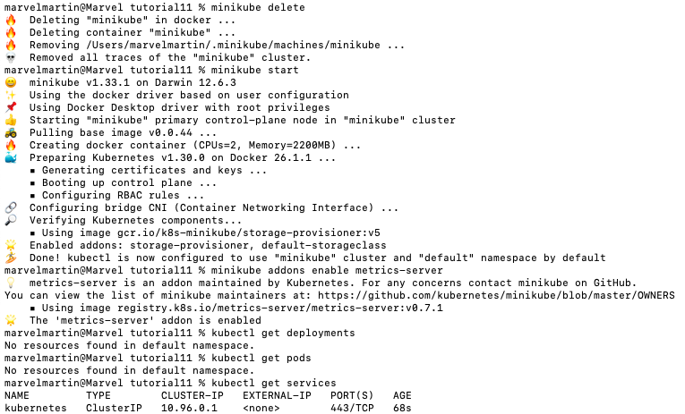
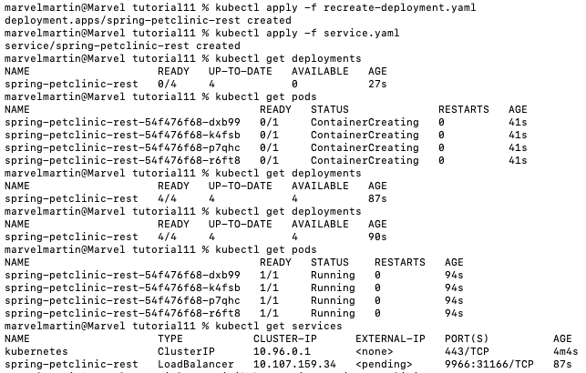
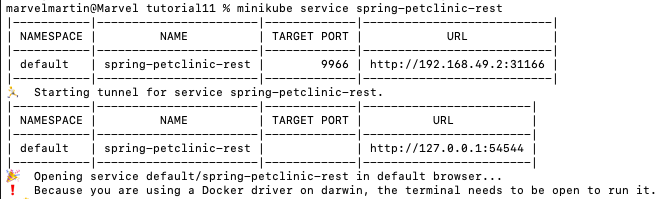
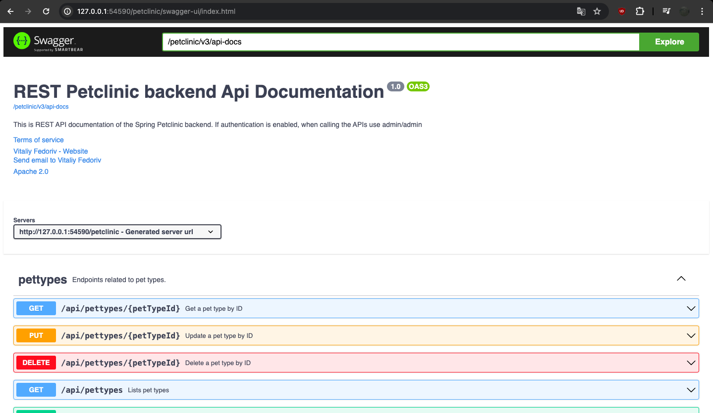

# Tutorial 11 - kubernetes
AdvPro B - Marvel Martin Everthard - 2206081345

## Reflection on Hello Minikube
1. _**Compare the application logs before and after you exposed it as a Service.
Try to open the app several times while the proxy into the Service is running.
What do you see in the logs? Does the number of logs increase each time you open the app?**_

- _**Before exposed:**_




- _**After exposed:**_



- _**After opening several times:**_



Sebelum aplikasi diakses melalui _service_, log hanya menunjukkan pesan awal bahwa server HTTP dan UDP telah start pada port 8080 dan 8081. Setelah aplikasi diakses melalui layanan dan permintaan HTTP dilakukan, log menunjukkan pesan tambahan yang menunjukkan permintaan GET HTTP yang dibuat ke aplikasi pada waktu yang berbeda. Jumlah log bertambah setiap kali aplikasi dibuka, seperti yang ditunjukkan oleh pesan log tambahan untuk setiap permintaan GET HTTP yang dilakukan ke aplikasi.


2. _**Notice that there are two versions of `kubectl get` invocation during this tutorial section.
The first does not have any option, while the latter has `-n` option with value set to `kube-system`.
What is the purpose of the `-n` option and why did the output not list the pods/services that you explicitly created?**_

Opsi `-n` dalam `kubectl get` digunakan untuk menentukan namespace di mana resource akan ditampilkan. Ketika dijalankan tanpa menyertakan opsi -n, maka kubectl get akan menampilkan resource dari namespace default. Membuat sumber daya di namespace dengan value kube-system menggunakan opsi `-n kube-system` untuk melihatnya akan menampilkan daftar pod dan layanan yang dibuat di namespace kube-system. 


## Reflection on Rolling Update & Kubernetes Manifest File

1. _**What is the difference between Rolling Update and Recreate deployment strategy?**_

Strategi Rolling Update dan strategi Recreate adalah dua cara yang berbeda untuk memperbarui deployment dalam Kubernetes. Dalam **Rolling Update**, Kubernetes secara bertahap mengganti pod lama dengan pod baru. Setiap pod baru harus siap sebelum pod lama dihapus. Hal ini memastikan bahwa **aplikasi tetap tersedia selama proses pembaruan** dan **menghindari downtime**. Sedangkan, dalam Recreate, Kubernetes secara langsung menghapus semua pod lama dan membuat pod baru dengan versi yang diperbarui. Hal ini **menyebabkan downtime** selama pembaruan karena seluruh aplikasi tidak tersedia sementara pod baru dibuat. 

2. _**Try deploying the Spring Petclinic REST using Recreate deployment strategy and document your attempt.**_






3. _**Prepare different manifest files for executing Recreate deployment strategy.**_

```
apiVersion: apps/v1
kind: Deployment
metadata:
  annotations:
    deployment.kubernetes.io/revision: "1"
    kubectl.kubernetes.io/last-applied-configuration: |
      {"apiVersion":"apps/v1","kind":"Deployment","metadata":{"annotations":{"deployment.kubernetes.io/revision":"1"},"creationTimestamp":"2024-05-17T11:20:34Z","generation":1,"labels":{"app":"spring-petclinic-rest"},"name":"spring-petclinic-rest","namespace":"default","resourceVersion":"597","uid":"046c85a2-7d1a-43a3-99cc-5f44165cea89"},"spec":{"progressDeadlineSeconds":600,"replicas":4,"revisionHistoryLimit":10,"selector":{"matchLabels":{"app":"spring-petclinic-rest"}},"strategy":{"type":"Recreate"},"template":{"metadata":{"creationTimestamp":null,"labels":{"app":"spring-petclinic-rest"}},"spec":{"containers":[{"image":"docker.io/springcommunity/spring-petclinic-rest:3.2.1","imagePullPolicy":"IfNotPresent","name":"spring-petclinic-rest","resources":{},"terminationMessagePath":"/dev/termination-log","terminationMessagePolicy":"File"}],"dnsPolicy":"ClusterFirst","restartPolicy":"Always","schedulerName":"default-scheduler","securityContext":{},"terminationGracePeriodSeconds":30}}},"status":{"availableReplicas":4,"conditions":[{"lastTransitionTime":"2024-05-17T11:21:49Z","lastUpdateTime":"2024-05-17T11:21:49Z","message":"Deployment has minimum availability.","reason":"MinimumReplicasAvailable","status":"True","type":"Available"},{"lastTransitionTime":"2024-05-17T11:20:34Z","lastUpdateTime":"2024-05-17T11:21:53Z","message":"ReplicaSet \"spring-petclinic-rest-54f476f68\" has successfully progressed.","reason":"NewReplicaSetAvailable","status":"True","type":"Progressing"}],"observedGeneration":1,"readyReplicas":4,"replicas":4,"updatedReplicas":4}}
  creationTimestamp: "2024-05-17T12:14:33Z"
  generation: 1
  labels:
    app: spring-petclinic-rest
  name: spring-petclinic-rest
  namespace: default
  resourceVersion: "1144"
  uid: 5589111d-2356-457f-864d-128b11361933
spec:
  progressDeadlineSeconds: 600
  replicas: 4
  revisionHistoryLimit: 10
  selector:
    matchLabels:
      app: spring-petclinic-rest
  strategy:
    type: Recreate
  template:
    metadata:
      creationTimestamp: null
      labels:
        app: spring-petclinic-rest
    spec:
      containers:
      - image: docker.io/springcommunity/spring-petclinic-rest:3.2.1
        imagePullPolicy: IfNotPresent
        name: spring-petclinic-rest
        resources: {}
        terminationMessagePath: /dev/termination-log
        terminationMessagePolicy: File
      dnsPolicy: ClusterFirst
      restartPolicy: Always
      schedulerName: default-scheduler
      securityContext: {}
      terminationGracePeriodSeconds: 30
status:
  availableReplicas: 4
  conditions:
  - lastTransitionTime: "2024-05-17T12:14:33Z"
    lastUpdateTime: "2024-05-17T12:15:51Z"
    message: ReplicaSet "spring-petclinic-rest-54f476f68" has successfully progressed.
    reason: NewReplicaSetAvailable
    status: "True"
    type: Progressing
  - lastTransitionTime: "2024-05-17T12:25:19Z"
    lastUpdateTime: "2024-05-17T12:25:19Z"
    message: Deployment has minimum availability.
    reason: MinimumReplicasAvailable
    status: "True"
    type: Available
  observedGeneration: 1
  readyReplicas: 4
  replicas: 4
  updatedReplicas: 4
```

4. _**What do you think are the benefits of using Kubernetes manifest files? Recall your experience in deploying the app manually and compare it to your experience when deploying the same app by applying the manifest files (i.e., invoking `kubectl apply -f` command) to the cluster.**_

Menggunakan file manifest dapat mempermudah dan mempercepat proses deployment, dibandingkan dengan cara manual. Dengan manifest file, kita dapat dengan mudah menerapkan konfigurasi yang sama ke berbagai lingkungan tanpa perlu mengetik ulang setiap kali. Selain itu, penggunaan manifest memastikan konsistensi konfigurasi dan meminimalkan potensi kesalahan yang kita buat.

5. _**(Optional) Do the same tutorial steps, but on a managed Kubernetes cluster (e.g., GCP). You need to provision a Kubernetes cluster on Google Cloud Platform. Then, re-run the tutorial steps (Hello Minikube and Rolling Update) on the remote cluster. Document your attempt and highlight the differences and any issues you encountered.**_